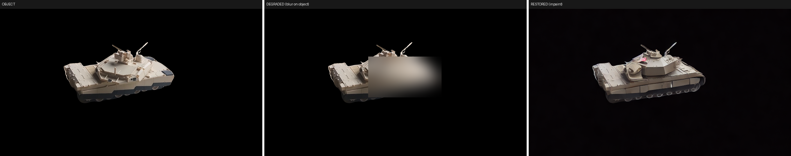
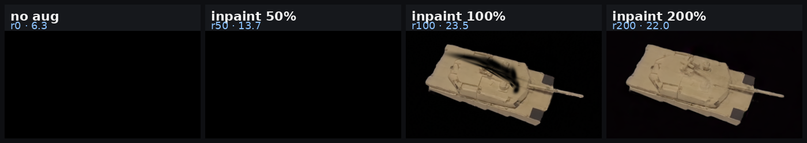
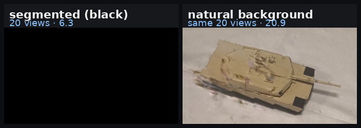
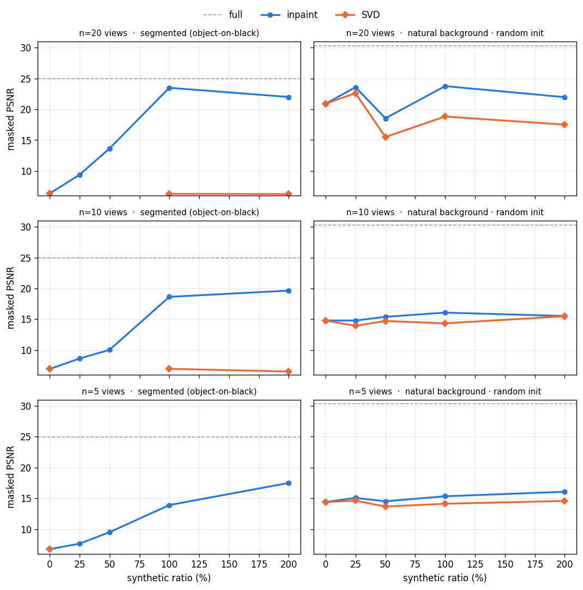
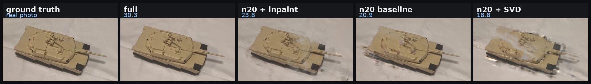
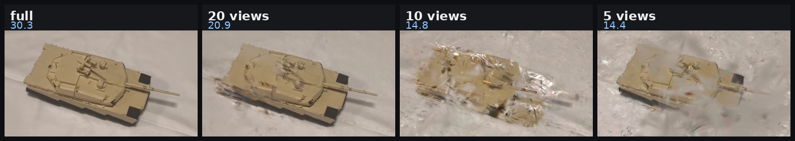

# Studying the Effect of Diffusion Augmentation on Few-Shot Gaussian Splatting

*Full report. Train Gaussian Splatting from a handful of real views, generate the missing
supervision with a diffusion model, and measure whether it recovers the quality of a full
capture. Object of study: a scale-model Abrams tank. Every score is **object-masked PSNR**
— the tank is measured, never the background.*

> **The short version:** diffusion augmentation *does* help few-shot object GS — but as
> clean **same-pose regularization** (inpaint), **not** as novel-view synthesis
> (Zero123 / SVD, which soften the reconstruction and *hurt*). Getting to that answer meant
> discovering that **two of our own setup choices** were quietly deciding the outcome.

*(An interactive HTML version with hover charts lives at
[`results/report/fewshot_report.html`](results/report/fewshot_report.html) — download it or
serve it via GitHub Pages; GitHub won't render HTML inline, which is why this Markdown exists.)*

---

## 1. The question

Gaussian Splatting is spectacular with hundreds of views and falls apart with a handful.
The premise: if we only have **5, 10, or 20** real photos of an object, can we **generate**
the missing supervision with a diffusion model and recover full-capture quality?

The experiment is a grid — few-shot size **N ∈ {5, 10, 20}** × synthetic:real ratio
**{0, 25, 50, 100, 200}%** × augmentation **strategy** — with a `full` (all-views) run as
the ceiling. The headline result is not the one we expected.

---

## 2. How we used diffusion

The guiding principle, learned early: **manipulate-then-restore beats hallucinate.** The
most useful synthetic frame is one anchored to something real.

**Inpaint — restore degraded detail at a real pose.** Take a real view, degrade a region
that sits **on the object** (masked to the object so the background is untouched), then ask
SD-inpainting to **restore** it. The output is a frame at the *exact* real camera pose,
photometrically consistent — it regularizes, it doesn't invent viewpoints.

*The inpaint process — a patch on the object is blurred, then diffusion restores plausible
sharp detail. This runs at every few-shot pose to build the synthetic pool.*

**SVD — genuine novel viewpoints, with poses we can trust.** Inpaint never adds *coverage*.
For that we extended the capture with **Stable Video Diffusion**. The hard part is the
camera pose of a generated frame — our earlier **Zero123** arm hand-computed it and diverged.
The fix: stop computing poses and run **COLMAP on the real + generated frames together**
(271/280 generated frames registered; recovered intrinsics matched the real camera to ~1%).

---

## 3. The story — two mistakes we made

We built the scene **object-centric**: segment the tank onto a black background before
COLMAP, so the point cloud is object-only and the metric is clean. On that setup, inpaint
looked *fantastic*:

*Segmented n20, same held-out view, as inpaint ratio rises — the object climbs out of the
black (r0/r50 brightened for visibility). n5 climbed 6.7 → 17.5, n20 6.3 → 23.5, near the
full ceiling of 25.0. We nearly wrote the paper here.*

Meanwhile **Zero123 diverged** (~6, below baseline) and **SVD came out neutral** even with
correct poses. Then one control test broke the tidy story:

*Mistake 1. Trained on the **same 20 views** but with the natural background left in, the
baseline jumped from **6.34 → 20.9** — with no augmentation at all.*

Gaussian Splatting leans on **background texture** to anchor a sparse optimization; segmenting
to black removed it and **destabilized few-shot**. So the celebrated inpaint gains were largely
*recovery from a handicap we had inflicted*. We archived the segmented pipeline and re-ran on
natural backgrounds (training on the full image, still scoring only the object).

**Mistake 2 — the point-cloud init.** The init cloud came from COLMAP on **all 320 views**,
so every "few-shot" run was secretly handed the complete object geometry:

| N | random init | + full-320 ply | leak |
|---|---|---|---|
| n5  | 14.39 | 20.95 | **+6.6** |
| n10 | 14.77 | 24.33 | **+9.6** |
| n20 | 20.91 | 28.10 | **+7.2** |

*Strip the leaked prior (random init) and n5 drops 20.95 → 14.39. A clean calibration:
**20 honest views ≈ 5 views + the full-scene ply.*** Only with **both** confounds removed —
natural background, random init — is the question finally honest.

---

## 4. The honest answer

*Dose–response on a shared y-axis. **Left (segmented):** inpaint rockets off a broken ~6
baseline. **Right (natural-bg, honest random init):** baselines already sit at 14–21, so
there is far less to add. (The n20 r50 dip is a random-init instability outlier.)*

The honest grid (object-masked PSNR):

| N | baseline | inp25 | inp50 | inp100 | inp200 | svd25 | svd50 | svd100 | svd200 |
|---|---|---|---|---|---|---|---|---|---|
| **n5**  | 14.39 | 15.07 | 14.51 | 15.33 | **16.06** | 14.62 | 13.66 | 14.12 | 14.57 |
| **n10** | 14.77 | 14.78 | 15.39 | **16.07** | 15.52 | 13.93 | 14.71 | 14.33 | 15.48 |
| **n20** | 20.91 | 23.59 | *(18.54)* | **23.76** | 21.97 | **22.61** | *(15.50)* | 18.83 | 17.51 |

*full (all views, ply init) = **30.32**. Parenthesised = random-init instability outliers.*

- **Inpaint helps at every N, peaking ~r100** (n20 **+2.9**). Robust — sharp same-pose supervision.
- **SVD is dose-dependent:** a small dose helps at n20 (**+1.7**) but larger doses **dilute and
  hurt** (−2.1, −3.4). And it's *not a bug* — poses/intrinsics/resolution were all verified.

You can read this straight off the renders — the SVD reconstruction is visibly the blurriest:

*Same held-out view by each model (natural-bg, n20). Inpaint sharpens the baseline; SVD softens it.*

**The unifying insight — augmentation's value inverts with init quality:**

| n20 | poor init (random) | Δ | good init (own-ply) | Δ |
|---|---|---|---|---|
| baseline | 20.91 | | 26.86 | |
| + inpaint r100 | 23.76 | **+2.85** ✅ | 25.32 | **−1.54** ❌ |
| + SVD r100 | 18.83 | −2.08 | 20.60 | **−6.26** ❌ |

*With a **poor** init synthetic frames add missing supervision and **help**; with a **good**
init (own-ply ≈ the full ply) the geometry is already there, so the same soft frames only
**dilute**. Inpaint "worked" earlier because the baseline was broken — fix it and little is
left to add.*

---

## 5. What it means

*Honest baselines (random init, no augmentation): fewer real views → rougher tank. This is
the gap augmentation is trying to close; the ceiling is `full` = 30.3.*

- **Diffusion augmentation does help few-shot object GS** — as clean *same-pose regularization*
  (inpaint), not as novel-view synthesis.
- **Novel-view synthesis (Zero123, SVD) does not help and can hurt** — even with geometrically
  correct poses — because generated views are softer and not mutually 3D-consistent enough to
  reinforce a reconstruction.
- **Setup dominates.** Object-on-black segmentation and a leaked full-scene ply each moved the
  numbers more than any augmentation did. The real lesson is methodological: *measure the
  confounds before crediting the method.*
- **Augmentation is worth most exactly where geometry is worst** — poor init, few real views.

> Diffusion can fill in what a few photos leave out — as long as what it fills in is a
> *sharper look at what was already there*, not a guess at what wasn't.

---

*Pipeline: segment/extract → COLMAP → assemble (real + synthetic) → splatfacto @30k → masked
eval → registry. Diffusion: SD-1.5 inpainting · Stable Video Diffusion (COLMAP-solved poses) ·
Zero123-xl (deprecated). Hardware: RTX 4060 8 GB. Full run-by-run reasoning in
[`results/report/TRAIN_OF_THOUGHT.md`](results/report/TRAIN_OF_THOUGHT.md); every number in
[`results/registry.jsonl`](results/registry.jsonl).*
